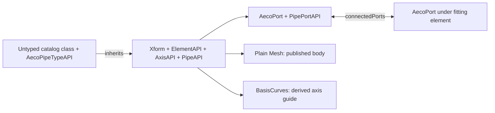
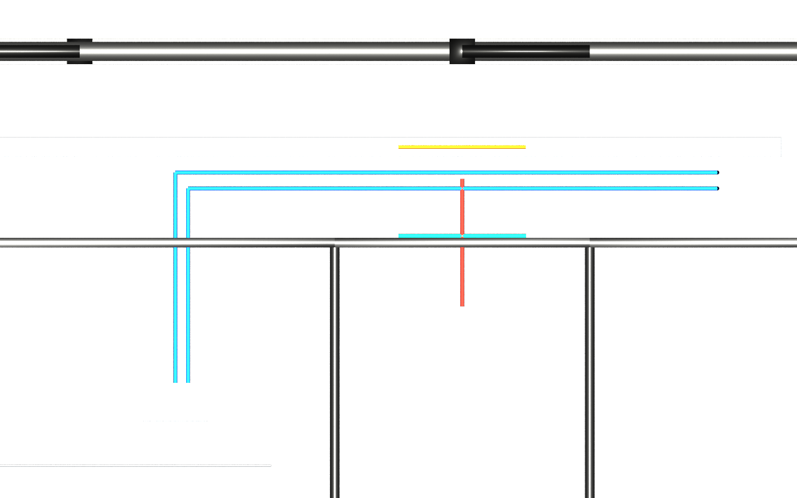

# Route K pipes

## 1 The problem

A coordinator can move a mesh and see a clear corridor while leaving the pipe's
connectors, nominal size and routing constraints unchanged. Native tools need
those inputs to rebuild connected pipes. A nominal-size edit may also require
new reducers, so copying one mesh back cannot describe the resulting network.

Route K preserves the editable axis and nominal-size contract. Fittings returned
by the authoring tool are real elements, with their own identity and ports.
This library describes that exchange; integrations perform native regeneration.

## 2 The data as it arrives

An IFC pipe typically arrives as `IfcPipeSegment`, a swept profile, a type,
`Pset_PipeSegmentTypeCommon` and nested `IfcDistributionPort` elements.
Nominal diameter is the catalog key; twice a hollow-profile radius is OD;
twice radius minus wall thickness is bore. These quantities are distinct.
Fittings arrive as `IfcPipeFitting` with their classification and connections.

The published data-centre stage already contains meshes, identity, classification,
ports, axis values and quarantined property sets. Its six fit-out pipe sections
use `DC_Section.NominalDiameter` and `OutsideDiameter`. The importer supports this
explicit fallback alongside the standard pipe property set. It never estimates
nominal size or bore from a tessellation. Of 482 segments, 476 have no published
nominal property; those values are blocked rather than receiving the schema's
DN50 default as if it were evidence. All 17 imported catalogs have incomplete
size tables. The IFC importer can recover complete rows from hollow profiles.

## 3 The model in USD

The five APIs refine occurrences, catalogs, fittings, ports and systems.
They introduce 18 properties and no new typed prim. Catalogs have no identity;
occurrences retain their existing `aeco:id`. `aeco:pipeFitting:origin` records
`authored` for imported fittings or `generated` for elements created to satisfy
editing intent. Bend/tee/transition kind remains an IFC classification code.

Editors author nominal diameter and axis drivers in intent layers. The size
table, OD, bore, label, slope, angle and radius carry `aecoDerived = true` in the
schema. Both importers separate these values into `*.derived.usda`; geometry
remains ordinary USD beneath the same referent. Axis derivation writes a separate
layer. Muting imported and derived layers restores the published core stage.

## 4 Workflow

1. Follow the [source setup](../README.md#build-and-check), with core first on the
   plugin path, then compose the pinned stage and input overlays.
2. Run `aeco-pipe import input.usda --out pipe.usda`. Standard pipe property sets
   take precedence over `DC_Section`; promoted source properties are value-blocked
   while unmapped fields, including Status, remain available.
3. Run `aeco-axis derive pipe.usda --out axis.derived.usda --composed route-k.usda`.
   The example invokes both source CLIs through the shared harness.
4. Run `aeco-pipe check route-k.usda`, or select keyword `UsdAecoPipeValidators`
   through `UsdValidation.ValidationRegistry` or `usdchecker --includeKeywords`.
5. Author an axis or nominal-size change in a new driver layer. A native integration
   applies it and returns dimensions, ports, geometry and generated fittings.
   Re-derive and validate after readback. This repository does not execute that
   integration step on the data-centre example.

Connected-end editing must preserve the port graph as well as placement. Moving
a fitting may stretch its adjacent runs; assigning only a pipe curve can leave
logically connected ports separated in space. Nominal sizes must be checked
against available table rows before application. A size change can create or
remove transition elements; those enter readback with independent identities,
not a token on the pipe. Coincident free ports do not imply a connection.

## 5 Validation

Names below are prefixed `usdAecoPipeValidators:`; plugin errors are ProperCase.
The legacy Python function retains lower-camel errors and profile names.

| Rule | Severity | Detects |
|---|---|---|
| PipeKindMismatchChecker | warn | Pipe/fitting API on incompatible IFC classification |
| PipeMissingAxisChecker | error | Pipe occurrence without AecoAxisAPI |
| PipeSizeNotInTableChecker | warn | Invalid size or malformed known catalog table |
| PipePortSizeMismatchChecker | warn | Direct pipe-to-pipe size disagreement without fitting |
| PipeGapChecker | error | Connected ports farther apart than 0.0001 m |

Gap checks use world positions and stage units, counting each undirected edge
once even for one-way links. A missing catalog is unknown, not an invalid size.
Core rules own identity, spatial grammar and connectivity integrity. A sync
integration owns the prohibition on derived edits in intent. Pipe validation is
not a geometric clash test and does not prove a complete engineering catalog.

## 6 The example on the demo data centre

Run `examples/datacentre/run.py` as documented in the
[example contract](../examples/datacentre/README.md). Source mode is `pinned`,
variant `clash`, release v0.4.8. No generator or converter runs for this example.
The published manifest supplies 2,980 elements, 35 spaces, 2 levels and 6,244 ports;
the semantic manifest supplies 482 pipe segments and 238 fittings.

Promotion applies 482 pipe, 238 fitting, 1,650 port, 17 type and 5 system APIs.
All three planted sweeps (`pipe.clash.hard`, `pipe.clash.near`,
`pipe.clash.tangent`) and the chilled-water pair (`pipe.chw.void.f`,
`pipe.chw.void.r`) have nominal 0.05 m, OD 0.0603 m and two promoted ports.
The pipeline derives 1,794 axes across the complete stage. Expected findings are
count/identity assertions plus any actual validator findings; the latter are empty.

The three straight sweep drivers are restored from the pinned manifest in an
explicit input overlay because the published conversion inferred local +Z axes.
The chilled-water pair retains its first-leg axis; its multi-leg mesh stays intact.
The overhead view hides extent guides and geometry wholly outside the L01 void
height band, including the roof, in a separate presentation layer. Red, amber,
green and blue distinguish identities; they do not report measured collision states.

## 7 Trade-offs and alternatives

Route K favors editable native inputs: axis, section choice and connections.
The authoring tool handles take-outs, bend families, routing preferences and
neighbor updates. Readback meshes are useful for visual coordination and mesh
clash tests, but their tessellation tolerance limits close-clearance evidence.

Route S instead exports an exact body, measures its cylindrical or planar faces
and keeps a mesh twin for plugin-free viewing. It can establish exact-body
clearance without requiring pipe drivers, at the cost of an exact geometry
runtime and without making the exported body a native parametric pipe editor.
Both routes reuse core identity and the derived-representation mark.

The clash showcase places a pipe through a wall, another 5 mm above a tray and
another tangent to a wall face. The pinned manifest's intended verdicts are
fixture expectations. This library supplies Route K semantics and the published
mesh evidence; the separate clash implementation must measure penetrations,
clearances and uncertainty. A 5 mm clearance or a tangent must not be declared
proven by this pipe render or by axis validation alone.

## 8 Out of scope and open questions

Native edit/readback, routing and automatic fitting creation are integration
responsibilities and were not run here. Hydraulic design, pipe insulation,
exact-body evaluation and mesh/exact clash comparison are separate work.
The five APIs are unchanged; they do not encode a general multi-segment axis.
The chilled-water pair therefore exposes an existing upstream representation
limit, while its complete body remains available for viewing and coordination.

Unknown nominal diameters, absent bore measurements and incomplete type tables
remain unknown. Downstream consumers needing complete catalog data must supply
an authoritative section source or use the optional IFC profile importer.

## 9 Status

Version 0.2.5 preserves the five APIs and 18-property contract while publishing
its standalone result with toolchain v0.3.10. Core v0.9.5 and axis v0.1.5 provide
validation and derived guides. The minimal fixture passes with zero errors and
warnings; the pinned data-centre pipe checks remain clean. See
[acceptance evidence](acceptance.md) for measured checks, artifact sizes and
upstream source warnings. Native body regeneration and clash verdicts remain
unproven here.
