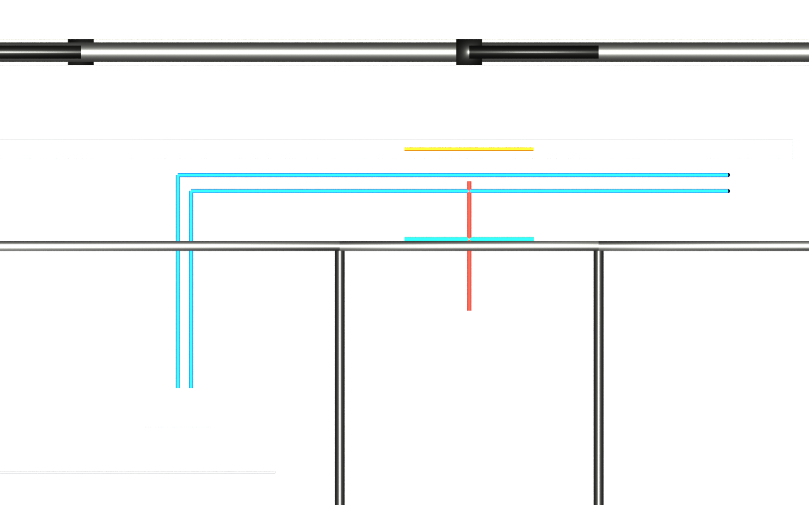

# Route K pipes in the L01 ceiling void

Input: the published `dist/clash/dc.usda` from `usdaeco-datacentre` v0.4.5.
`AECO_DATACENTRE_ROOT` selects the checkout; the runner defaults to the named
sibling and verifies its version. If that sibling has advanced, it exports the
pinned local Git tag into ignored `out/pins/` without modifying the sibling. `AECO_DATACENTRE_STAGE` is an explicit
compatibility override and is recorded as source mode `override`.

```sh
env -u PYTHONPATH "$AECO_PYTHON" examples/datacentre/run.py
```

The shared `run_example` harness composes `inputs/*.usda`. The library hook runs
`aeco-pipe import`, then `aeco-axis derive`, then the registered pipe validators.
The ordinary run writes only `out/`; `--publish` updates the flattened
`result/example.usdc`, own layers under `result/layers/`, `result/README.md`,
`result/vanilla.png`, committed renders and `manifest.json`. Open the crate with
`usdview result/example.usdc` from this directory, with no family plugins or
sibling checkouts. S27 checks relocation and fresh-result equivalence; S28
independently renders the committed crate in a fresh plugin-free process. Expected findings are never silently regenerated.

`inputs/axes.usda` restores the three straight sweep axes using the v0.4.1
`manifests/demo-datacentre-01.clash.json` source coordinates. The published
converter inferred their axes along +Z. This driver overlay does not change
bodies or placements. The multi-leg chilled-water pair retains its published
first-leg axes; the single-axis contract cannot encode those whole routes.
`inputs/cameras.usda` supplies the overhead view. Dimensions are promoted from
property sets already in the published stage, including its `DC_Section` fallback.

Expected counts come from `dist/clash/dc.manifest.json` (2,980 elements, 35 spaces,
2 levels, 6,244 ports) and `manifests/demo-datacentre-01.clash.json`
(482 pipe segments, 238 fittings). Five identity rows require DN50, 60.3 mm OD,
an inherited catalog and two pipe ports. Zero pipe-validator findings are expected.

Outputs: `pipe.usda` for imported drivers, `pipe.derived.usda` for readback,
`axis.derived.usda` composing four `axis/part-*.usda` batches for 1,794 axis guides, `presentation.usda` for visibility and
colors, `example.usda` as the composed root, `findings.json`, `import.json`,
`axis.json`, render and manifest. All source layer bytes remain unchanged.


Red: hard-case sweep. Amber: near-case sweep. Green: tangent-case sweep.
Blue: chilled-water pair. These colors identify fixtures; no collision solver
runs here. Roof and other geometry outside the void band are hidden for this
view. Every `role = extent` guide is explicitly invisible. The final render uses
`--purposes guide,proxy,render`; the kit's v0.3.5 harness first renders its fixed
proxy/render pass, then the runner refreshes the image and measured manifest
using the same renderer with guides enabled. `result/vanilla.png` independently
uses the S28 proxy/render purposes without family plugins; source extent guides
stay hidden. Each archived USDA is limited to 2,000,000 bytes; the whole result
is limited to 10,000,000 bytes. The full axis output exceeds the per-layer cap,
so it is split into deterministic batches with composed Sdf opinions checked
for equality before publication.



All eight core validators are required to load in the gate. The minimal pipe-run
fixture passes core, pipe and built-in validation with zero warnings. The pinned
data-centre example passes pipe validation; its source retains two unrelated core
classification warnings on utility-intake proxies.

The [use case](../../docs/usecase.md) explains Route K and Route S. Exact clashes
and native edit/readback are not proven by this example.

The pinned runner creates the ignored `inputs/source` symlink from
`AECO_DATACENTRE_ROOT`. Select the exact release recorded in `dependencies.json`
when relocating the checkout, then run `run.py`. Archived layers reference the
source through `../../../inputs/source/dist/clash/dc.usda` from
`result/layers/out/`; links to other archived layers remain relative.
S29 checks these paths even before the symlink exists. The flattened
`result/example.usdc` remains immediately viewable without the source checkout.
