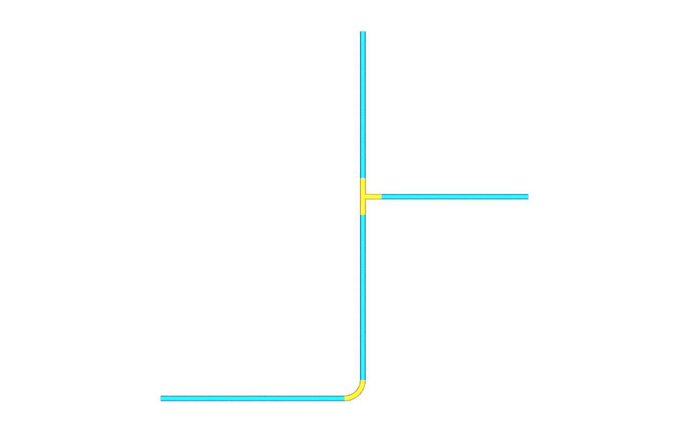

# Overview

`usdAecoPipe` adds pipe dimensions, catalogs, fitting provenance, connector
refinements and fluid data to core referents. The five APIs introduce no geometry
or new typed prims. The [minimal pipe run](../examples/minimal.usda) contains four
pipes, an elbow, a tee, thirteen ports and a water system. All five connected
port pairs coincide. DN50, DN65 and DN80 are distinct rows in its inherited table.

Enable guide purpose to see the standard BasisCurves. This image is rendered
from that stage with `cameras.usda` and a separate analytic display layer,
using the shared renderer and
`--purposes guide,proxy,render`. The curves are illustrative derived guides,
not native fitting solids or an engineering fabrication model. The display
layer draws radius 0.03015 m Cylinder segments around the example curves and
marks them `approx = defaultDims`. Reproduce it with `tools/render_example.py`.

Four driven guides are generated by axis v0.1.1, including numerical tolerances.
The tee has two straight branches and no axis drivers; its stored guide declares
`aeco:derived:tolerance = 1e-8` metres, exceeding the float32 encoding error of
its 0.2 m coordinates. The segmented elbow remains a stored `arcSegmented` guide.

See the [property reference](../../docs/README.md),
[Route K use case](../../docs/usecase.md) and
[pinned data-centre example](../../examples/datacentre/README.md).
